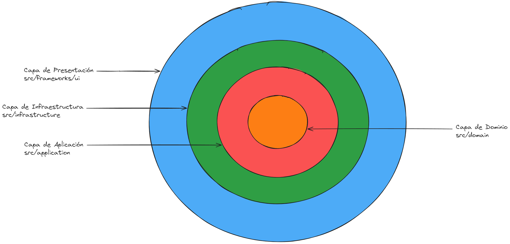

# Proyecto React con Arquitectura Clean

Este proyecto es una aplicación **React** construida con **TypeScript**, estructurada siguiendo los principios de la **Arquitectura Clean**. El objetivo es proporcionar una base sólida y escalable para el desarrollo de aplicaciones front-end, promoviendo la separación de responsabilidades y facilitando el mantenimiento y la extensibilidad.

## Tabla de Contenidos

- [Descripción General](#descripción-general)
- [Arquitectura Clean](#arquitectura-clean)
  - [Principios Básicos](#principios-básicos)
  - [Capas de la Arquitectura](#capas-de-la-arquitectura)
- [Estructura de Directorios](#estructura-de-directorios)
- [Detalles de Cada Capa](#detalles-de-cada-capa)
  - [Dominio (Domain Layer)](#dominio-domain-layer)
  - [Aplicación (Application Layer)](#aplicación-application-layer)
  - [Infraestructura (Infrastructure Layer)](#infraestructura-infrastructure-layer)
  - [Frameworks y Controladores (Frameworks Layer)](#frameworks-y-controladores-frameworks-layer)
- [Tecnologías Utilizadas](#tecnologías-utilizadas)
- [Configuración y Puesta en Marcha](#configuración-y-puesta-en-marcha)
- [Convenciones de Código](#convenciones-de-código)
- [Tests](#tests-y-coverage)
- [Buenas Prácticas](#buenas-prácticas)
- [Contribución](#contribución)
- [Contacto](#contacto)

## Descripción General

Este proyecto sirve como plantilla para desarrollar aplicaciones React utilizando TypeScript y siguiendo la Arquitectura Clean. La estructura está diseñada para facilitar:

- **Mantenibilidad:** Separación clara de responsabilidades.
- **Escalabilidad:** Fácil adición de nuevas funcionalidades.
- **Testabilidad:** Capas internas testeables de forma aislada.
- **Flexibilidad:** Independencia de frameworks y herramientas específicas.

## Arquitectura Clean

La Arquitectura Clean, propuesta por Robert C. Martin (Uncle Bob), promueve una separación estricta de las responsabilidades en diferentes capas, permitiendo que la lógica de negocio sea independiente de los frameworks y tecnologías externas.

### Principios Básicos

- **Independencia de Frameworks:** La lógica de negocio no depende de frameworks específicos.
- **Testabilidad:** Las reglas de negocio pueden ser testeadas sin dependencias externas.
- **Independencia de la Interfaz de Usuario:** La UI puede cambiar sin afectar la lógica de negocio.
- **Independencia de la Base de Datos:** Los detalles de almacenamiento están separados de la lógica de negocio.
- **Inversión de Dependencias:** Las capas internas no dependen de las externas.

### Capas de la Arquitectura

1. **Dominio (Domain Layer):** Contiene las entidades y modelos de negocio fundamentales.
2. **Aplicación (Application Layer):** Define los casos de uso y la lógica de aplicación.
3. **Infraestructura (Infrastructure Layer):** Implementa detalles técnicos como acceso a datos y comunicación con APIs.
4. **Frameworks y Controladores (Frameworks Layer):** Contiene los frameworks y herramientas externas, como React.

## Estructura de Directorios

```
src/
├── application/
│   └── use_cases/
├── domain/
│   ├── entities/
│   └── repositories/
├── infrastructure/
│   ├── http/
│   │   ├── dtos/
│   │   └── mappers/
│   └── repositories/
└── frameworks/
    └── ui/
        ├── components/
        ├── pages/
        └── contexts/
```

## Detalles de Cada Capa



**Importante**: La comunicación entre capas, se hace de manera descendente. Una capa inferior no puede comunicarse con una capa exterior.

### Dominio (Domain Layer)

- **Descripción:** Contiene las entidades de negocio y las interfaces de los repositorios.
- **Ubicación:** `src/domain/`
- **Componentes:**
  - **Entities:** Clases que representan los modelos de negocio.
  - **Repositories:** Interfaces que definen los métodos para acceder y manipular las entidades.

**Ejemplo de Entidad:**

```typescript
export class User {
  public id: number;
  public name: string;
  public email: string;

  constructor(params: { id: number; name: string; email: string }) {
    this.id = params.id;
    this.name = params.name;
    this.email = params.email;
  }
}
```

**Ejemplo de Repositorio:**

```typescript
import { User } from '../entities/User';

export interface UserRepository {
  getByID(id: number): Promise<User | null>;
  getAll(): Promise<User[]>;
  save(user: User): Promise<void>;
}
```

### Aplicación (Application Layer)

- **Descripción:** Define los casos de uso de la aplicación y contiene la lógica de negocio específica.
- **Ubicación:** `src/application/`
- **Componentes:**
  - **Use Cases:** Clases o funciones que implementan la lógica de los casos de uso.

**Ejemplo de Caso de Uso:**

```typescript
import { UserRepository } from '../../domain/repositories/UserRepository';
import { User } from '../../domain/entities/User';

export class GetUserUseCase {
  private userRepository: UserRepository;

  constructor(userRepository: UserRepository) {
    this.userRepository = userRepository;
  }

  async execute(id: number): Promise<User | null> {
    // Aca se pueden hacer otras operaciones
    // Todo lo necesario para poder resolver el caso de uso
    return await this.userRepository.getByID(id);
  }
}
```

### Infraestructura (Infrastructure Layer)

- **Descripción:** Proporciona implementaciones concretas para las interfaces de repositorios y maneja detalles técnicos como llamadas HTTP y transformación de datos.
- **Ubicación:** `src/infrastructure/`
- **Componentes:**
  - **Repositories:** Implementaciones concretas de los repositorios.
  - **HTTP:** Manejo de llamadas HTTP y transformación de DTOs.
    - **DTOs:** Definiciones de los objetos de transferencia de datos.
    - **Mappers:** Funciones para mapear DTOs a entidades de dominio.

**Ejemplo de Implementación de Repositorio:**

```typescript
import axios from 'axios';
import { UserRepository } from '../../domain/repositories/UserRepository';
import { User } from '../../domain/entities/User';
import { UserDTO } from '../http/dtos/UserDTO';
import { UserMapper } from '../http/mappers/UserMapper';

export class UserRepositoryImplementation implements UserRepository {
  private baseUrl: string = 'https://api.example.com';

  async getByID(id: number): Promise<User | null> {
    try {
      const response = await axios.get<UserDTO>(`${this.baseUrl}/users/${id}`);
      return UserMapper.toDomain(response.data);
    } catch {
      return null;
    }
  }

  // Implementación de otros métodos...
}
```

### Frameworks y Controladores (Frameworks Layer)

- **Descripción:** Contiene los frameworks y herramientas externas, así como la capa de presentación (UI).
- **Ubicación:** `src/frameworks/`
- **Componentes:**
  - **UI:** Componentes y páginas de React.
    - **Components:** Componentes reutilizables de la interfaz de usuario.
    - **Pages:** Vistas o páginas que combinan múltiples componentes.
    - **Contexts:** Contextos de React para manejo de estado y dependencias.

**Ejemplo de Componente:**

```tsx
import React, { useEffect, useState, useContext } from 'react';
import { User } from '../../../domain/entities/User';
import { GetUserUseCase } from '../../../application/use_cases/GetUserUseCase';
import { UserContext } from '../contexts/UserContext';

interface Props {
  userID: number;
}

export const UserDatil: React.FC<Props> = ({ userID: userID }) => {
  const { userRepository } = useContext(UserContext);
  const [user, setUser] = useState<User | null>(null);

  useEffect(() => {
    const getUser = async () => {
      const useCase = new GetUserUseCase(userRepository);
      const userData = await useCase.execute(userID);
      setUser(userData);
    };
    getUser();
  }, [userID, userRepository]);

  if (!user) {
    return <div>Cargando...</div>;
  }

  return (
    <div>
      <h2>{user.name}</h2>
      <p>Email: {user.email}</p>
    </div>
  );
};
```

## Tecnologías Utilizadas

- **React** con **TypeScript**
- **Axios** para llamadas HTTP
- **Context API** de React para inyección de dependencias
  - Puede verse de integrar una librería para el manejo de estados, como Redux o Zustand.
- **MSW** para hacer mocking de las consultas a la API
- **React Router** para enrutamiento
- **ChakraUI** para componentes de UI
- **Husky** para hacer uso de los hooks de Git

## Configuración y Puesta en Marcha

1. **Clonar el repositorio:**

   ```bash
   git clone https://github.com/nahugomez/react-clean-architecture
   ```

2. **Instalar dependencias:**

   ```bash
   cd react-clean-architecture
   pnpm install
   ```

3. **Configurar variables de entorno:**

   Crear un archivo `.env` en la raíz del proyecto si es necesario y agregar las variables de entorno requeridas, como URLs de APIs, entorno de la aplicación o tokens de autenticación.

4. **Iniciar la aplicación:**

   ```bash
   pnpm run dev
   ```

   La aplicación estará disponible en `http://localhost:5147`.

## Convenciones de Código

- **Nomenclatura:**
  - **Clases y Tipos:** `PascalCase`
  - **Funciones y Variables:** `camelCase`
- **Comentarios:** Utilizar JSDoc para documentación de funciones y clases.

```js
/**
 * Devuelve la información de un usuario
 *
 * @param {number} userId - El ID del usuario.
 * @returns {Promise<UserProfile>} La información del Usuario.
 */
async function getUserProfile(userId) {
  // Implementation...
}
```

**Linting & Formatting:** Se utiliza ESLint y Prettier para mantener buenas prácticas y estilo de código
Previo a realizar un _commit_, se ejecutará automáticamente ESLint para aplicar las reglas establecidas.

- **Herramientas:** Utilizar ESLint para mantener la calidad del código y Prettier para el formateo automático.
- **Configuración:** Asegurarse de tener instaladas las siguientes extensiones en VSCode:
  - ESLint: Para mostrar errores de linting en tiempo real.
  - Prettier - Code formatter: Para formateo automático de código.

Recomiendo colocar dentro de la carpeta `.vscode/` el siguiente JSON de configuración para el editor de código:

```json
{
  "editor.defaultFormatter": "esbenp.prettier-vscode",
  "editor.formatOnPaste": true,
  "editor.formatOnSave": true,
  "eslint.alwaysShowStatus": true,
  "editor.codeActionsOnSave": {
    "source.fixAll.eslint": true
  },
  "prettier.requireConfig": true
}
```

## Tests y Coverage

El proyecto está configurado para utilizar [Vitest](https://vitest.dev/) como framework de tests. Para ejecutar los tests, y desplegar una interfaz gráfica para visualizar los resultados, ejecutar el siguiente comando:

```bash
pnpm test
```

Para ejecutar los tests con cobertura, ejecutar el siguiente comando:

```bash
pnpm coverage
```

Esto va a generar un archivo `coverage/index.html` que se puede abrir en un navegador para ver los resultados de las pruebas.

## Buenas Prácticas

- **Separación de Responsabilidades:** Cada módulo o clase debe tener una única responsabilidad.
- **Inversión de Dependencias:** Las capas internas no deben depender de las externas.
- **Testabilidad:** Escribir pruebas unitarias para los casos de uso y entidades.
- **Uso de DTOs:** Para transformar datos entre la infraestructura y el dominio.
- **Gestión de Estado:** Utilizar Context API o bibliotecas como Redux si es necesario, pero manteniendo la lógica de negocio fuera de los componentes.

## Contacto

Para cualquier duda o sugerencia, podés contactarme a través de:

- **Email:** nahuelgomezsuarez@gmail.com
- **GitHub:** [nahugomez](https://github.com/nahugomez)

---

Espero que esta guía sirva como base para que los desarrolladores puedan crear proyectos con un código extensible, testeable, y mantenible a largo plazo.
